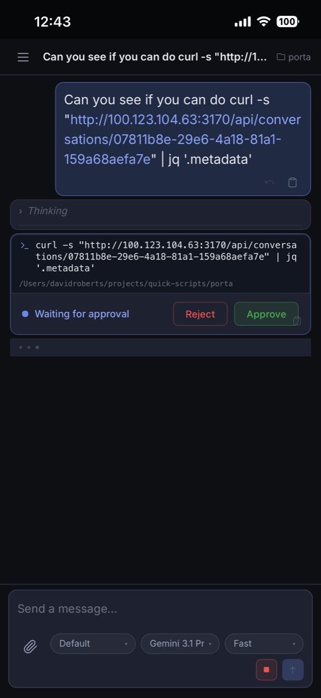
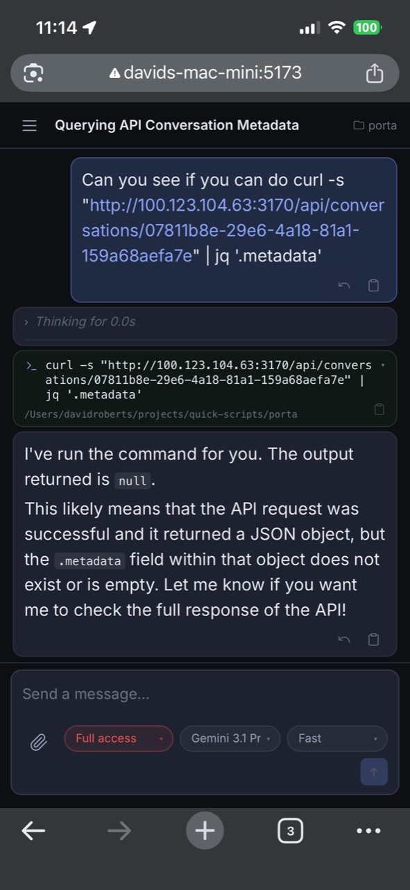

# Porta

[](https://github.com/dav-rob/porta/actions/workflows/ci.yml)
[](LICENSE)


Porta is a mobile-friendly web UI for local
[Antigravity](https://antigravity.google/) agent sessions.

This is a Tailscale-focused fork of
[L1M80/porta](https://github.com/L1M80/porta).

This fork is primarily aimed at using **Tailscale + iPhone** to get a
Codex-like mobile control surface for Antigravity: launch the desktop app over
SSH, start Porta with `runporta`, then use the Porta web UI from the phone.

- [Tailscale workflow](#tailscale-workflow)
- [Full Access mode](#full-access-mode)
- [Architecture](#architecture)
- [Optional Cloudflare remote access](docs/cloudflare.md)

## Agent Permissions

Default keeps command approval manual. Full access (in red) auto-approves
terminal command prompts for the workspace.

<p align="center">
  
  
</p>

## Quick Start

Prerequisites:

- macOS machine running Antigravity
- [Tailscale](https://tailscale.com/download) on the Mac and iPhone
- [Node.js](https://nodejs.org/) 22+
- [pnpm](https://pnpm.io/) 10+
- An iPhone SSH client such as Termius, Terminus, or similar

Install Porta:

```bash
git clone https://github.com/dav-rob/porta.git
cd porta
pnpm install
cp .env.example .env
```

Copy the personal launcher:

```bash
cp scripts/util/runporta.sh ~/runporta.sh
chmod +x ~/runporta.sh
```

Add a shell alias if you want the command to be just `runporta`:

```bash
alias runporta="$HOME/runporta.sh"
```

Start, stop, and restart Porta with:

```bash
runporta start
runporta stop
runporta restart
```

When started, the script prints the Tailscale URL to open on the iPhone, for
example:

```text
Phone/iPad: http://100.123.104.63:5173
```

## Tailscale Workflow

The intended flow for this fork is:

1. Install and connect Tailscale on the Mac and iPhone.
2. SSH to the Mac from the iPhone using Termius or a similar app.
3. Launch Antigravity or Codex on the Mac from that SSH session.
4. Run `runporta start`.
5. Open the printed Tailscale URL on the iPhone.
6. Use Porta as the mobile web UI for Antigravity.

### Launching Antigravity and Codex from SSH

Add this helper to `~/.zshrc`, or source the repo copy from there:

```bash
source ~/projects/quick-scripts/porta/scripts/util/launch_bg_app.zsh
```

The helper defines:

```bash
launch_bg_app() {
    local app_name="$1"
    if [[ -z "$app_name" ]]; then
        echo "Usage: launch_bg_app \"App Name\""
        return 1
    fi

    nohup open -na "$app_name" >/tmp/${app_name// /_}.log 2>&1 &
}

alias runantigravity='launch_bg_app "Antigravity"'
alias runcodex='launch_bg_app "Codex"'
alias runporta="$HOME/runporta.sh"
```

Then from the iPhone SSH session:

```bash
runantigravity
runporta start
```

Use `runcodex` the same way when you want to launch Codex.

## Full Access Mode

Porta has a workspace permission selector in the chat composer:

- `Default`: terminal command prompts stay manual.
- `Full access`: terminal command prompts are auto-approved for that workspace.

This is intended to emulate the useful parts of Codex's permission mode inside
Porta. It is workspace-scoped, so one workspace can use Full Access while
another stays on Default.

File permission prompts are not auto-approved by this mode. They stay manual.

## Architecture

Porta has three main parts.

### Web App

The React UI running in the browser. It shows the chat list, chat view, command
cards, file permission cards, input box, settings, and workspace permission
selector.

### Porta Proxy

The local TypeScript server between the browser and Antigravity.

The browser talks to Porta over HTTP and WebSocket. Porta talks to the local
Antigravity language server / RPC API.

The live chat view works through a WebSocket. The web app opens a socket to
Porta for the current conversation. Porta keeps reading new steps from
Antigravity and pushes those steps to the browser.

### Antigravity Language Server

The local service that owns the agent session. It produces conversation steps:
messages, tool calls, command permission requests, file permission requests,
and run status updates.

This local API is private rather than a documented public Google SDK. Porta
discovers it by finding Antigravity's local language server process or daemon
metadata, reading the dynamic port and CSRF token, then calling local
Connect/RPC-style endpoints such as:

```text
/exa.language_server_pb.LanguageServerService/GetCascadeTrajectorySteps
```

The endpoint names and payloads are based on observed Antigravity behavior and
Codeium/Windsurf language-server conventions. Future Antigravity updates may
require adapter changes in the proxy.

## How Full Access Works

The workspace permission selector stores one setting per workspace in the
browser.

When the chat view fetches or streams steps, the web app sends the current mode
to the proxy:

```text
/api/conversations/:id/steps?permissionMode=full
/api/conversations/:id/ws?permissionMode=full
```

or:

```text
permissionMode=default
```

The proxy then applies the mode while handling incoming Antigravity steps:

- If the mode is `default`, it does nothing and command permission cards stay
  manual.
- If the mode is `full`, it watches for waiting terminal command permission
  requests and sends Antigravity the same approval response the user would send
  by pressing Approve.
- File permission requests are ignored by this auto-approval path.

Full Access does not change Antigravity globally. It is Porta approving
terminal command permission steps on the user's behalf for the active
workspace.

## Other Remote Access

This fork is Tailscale-first. Cloudflare access is still possible, but it is no
longer the primary README path. See [Cloudflare remote access](docs/cloudflare.md).

## Development

Common commands:

```bash
pnpm -r test
pnpm -r build
pnpm dev
pnpm dev:tailscale
```

See [AGENTS.md](AGENTS.md) for short notes for future coding agents.

## Security

To report a vulnerability, see [SECURITY.md](SECURITY.md).

## License

[MIT](LICENSE)
