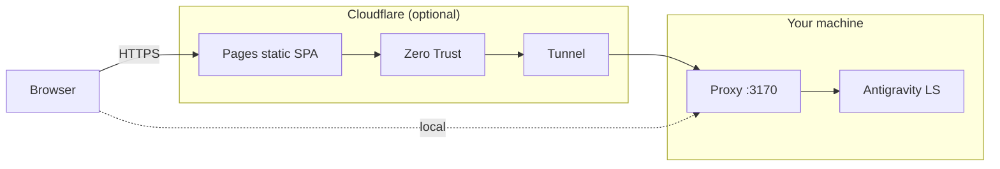

# Cloudflare Remote Access

Cloudflare is an option for users who want a public hostname, Cloudflare Pages,
Tunnel, and optional Zero Trust access in front of Porta.

## Overview



- Local/Tailscale mode: Browser -> Porta proxy -> Antigravity LS.
- Cloudflare mode: Browser -> Pages -> Zero Trust -> Tunnel -> Porta proxy ->
  Antigravity LS.

## Option A: Quick Tunnel

Use this only for temporary testing.

- No custom domain required.
- Useful for demos.
- Not recommended for regular use because the hostname is temporary.

Follow Cloudflare's current docs:

- [Quick Tunnels](https://developers.cloudflare.com/cloudflare-one/networks/connectors/cloudflare-tunnel/do-more-with-tunnels/trycloudflare/)
- [Cloudflare Tunnel setup](https://developers.cloudflare.com/tunnel/setup/)

## Option B: Named Tunnel + Pages

This is the stable pattern for regular Cloudflare use. It requires:

- A Cloudflare account.
- `cloudflared` installed and authenticated.
- A Cloudflare Pages project.
- A domain managed by Cloudflare for the tunnel hostname.
- Optionally, Cloudflare Zero Trust.

### 1. Configure `.env`

```bash
PORTA_CORS_ORIGINS=https://<YOUR_PAGES_DOMAIN>
PORTA_TUNNEL_NAME=<YOUR_TUNNEL_NAME>
PORTA_CF_PROJECT=<YOUR_PROJECT_NAME>
```

### 2. Create the named tunnel

Point the tunnel at your local proxy:

```bash
cloudflared tunnel create <YOUR_TUNNEL_NAME>
cloudflared tunnel route dns <YOUR_TUNNEL_NAME> <YOUR_API_SUBDOMAIN>
```

### 3. Create `.env.production`

```bash
VITE_API_BASE=https://<YOUR_API_SUBDOMAIN>
```

### 4. Build and deploy the SPA

```bash
pnpm deploy
```

### 5. Start the proxy + named tunnel

```bash
pnpm dev:cloud
```

## Securing the API with Cloudflare Access

For a locked-down setup, protect both the frontend and API with Cloudflare
Access.

1. Create two Access applications:
   - Frontend app: protects the Pages deployment.
   - Backend API app: protects the tunnel hostname.
2. Create a Service Token under Access -> Service Auth.
3. Add a Service Auth policy to the Backend API app.
4. Add these Cloudflare Pages environment variables:
   - `PORTA_API_BASE`
   - `CF_ACCESS_CLIENT_ID`
   - `CF_ACCESS_CLIENT_SECRET`
5. Remove `VITE_API_BASE` from `.env.production` if you want frontend requests
   to route through the Pages edge proxy at `/api/*`.

If `VITE_API_BASE` is defined, the frontend talks directly to the backend. That
is still supported for local, LAN, Tailscale, or unprotected-backend setups.
