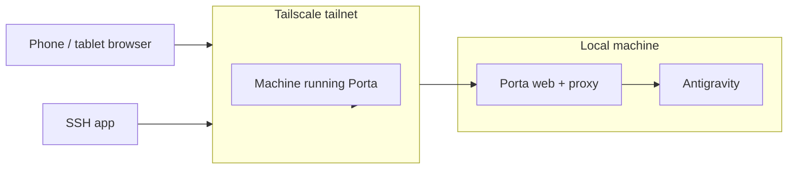

# Tailscale Remote Access

Tailscale is a private mesh VPN option for using Porta from another device,
such as an iPhone or iPad, without exposing the proxy directly to the public
internet.

## Overview



The usual flow is:

1. Install and connect Tailscale on the machine running Antigravity.
2. Install and connect Tailscale on the phone or tablet.
3. Start Antigravity on the machine.
4. Start Porta with the Tailscale dev command or helper script.
5. Open the printed Tailscale URL on the phone or tablet.

## Start Porta on Tailscale

You can start Porta directly:

```bash
pnpm dev:tailscale
```

For repeated use, this fork also includes a helper script:

```bash
cp scripts/util/runporta.sh ~/runporta.sh
chmod +x ~/runporta.sh
```

Add an alias if you want the command to be just `runporta`:

```bash
alias runporta="$HOME/runporta.sh"
```

Start, stop, and restart Porta with:

```bash
runporta start
runporta stop
runporta restart
```

When started, the script prints the Tailscale URL to open on the phone or
tablet, for example:

```text
Phone/iPad: http://100.123.104.63:5173
```

## Launch Antigravity or Codex over SSH

If you SSH into the machine from the phone, you can use the helper in
`scripts/util/launch_bg_app.zsh` to launch desktop apps from that SSH session.

Add this helper to `~/.zshrc`, or source the repo copy from there:

```bash
source ~/projects/quick-scripts/porta/scripts/util/launch_bg_app.zsh
```

The helper defines:

```bash
launch_bg_app() {
    local app_name="$1"
    if [[ -z "$app_name" ]]; then
        echo "Usage: launch_bg_app \"App Name\""
        return 1
    fi

    nohup open -na "$app_name" >/tmp/${app_name// /_}.log 2>&1 &
}

alias runantigravity='launch_bg_app "Antigravity"'
alias runcodex='launch_bg_app "Codex"'
alias runporta="$HOME/runporta.sh"
```

Then from the phone SSH session:

```bash
runantigravity
runporta start
```

Use `runcodex` the same way when you want to launch Codex.

## Notes

- Tailscale should keep Porta reachable only inside your tailnet.
- Antigravity still needs to be running on the same machine as the Porta proxy.
- `runporta.sh` is only a convenience wrapper. It is not required for normal
  local development.
